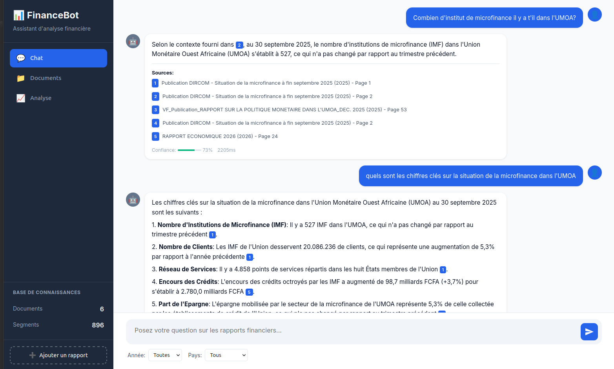
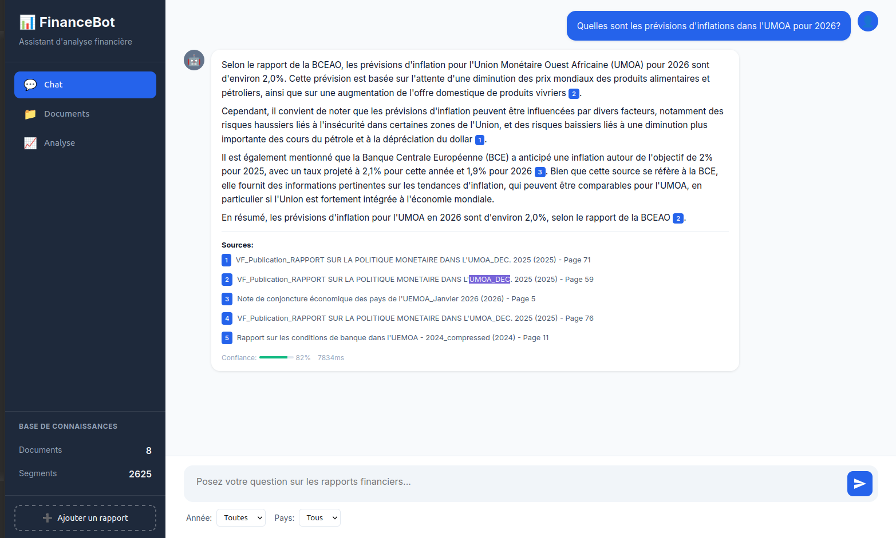
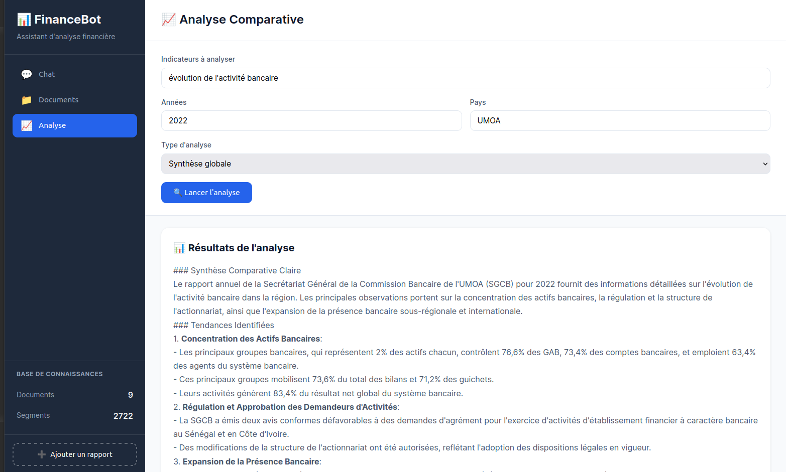
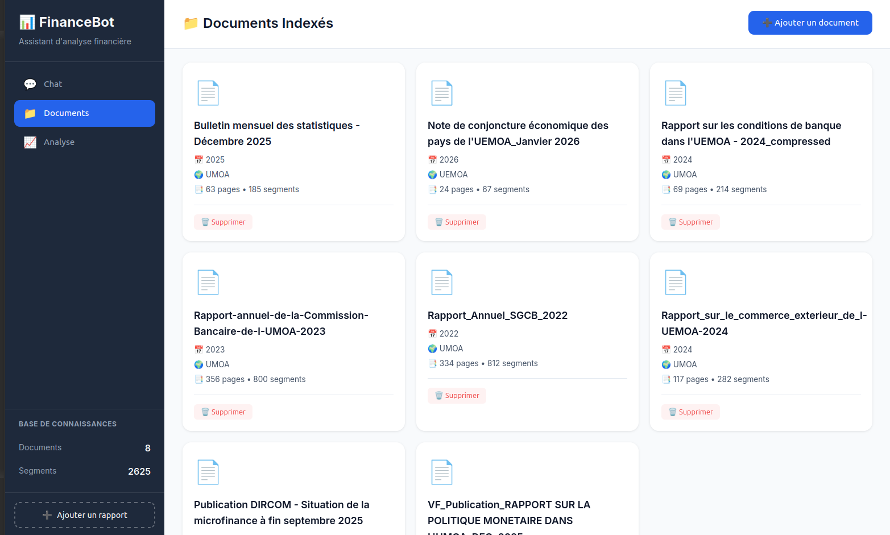

## Contexte du projet

Ce projet est né d'une question concrète : comment permettre à un utilisateur d'interroger des rapports financiers en langage naturel, sans dépendre d'une API payante et en gardant les données en local ?

L'objectif principal était de construire un pipeline **RAG (Retrieval-Augmented Generation)** complet, de l'ingestion des PDFs jusqu'à la réponse avec citations de sources précises — document, année, page.

## Objectifs techniques

- Ingérer et indexer des rapports PDF de structure variable
- Retrouver les passages les plus pertinents pour chaque question
- Générer une réponse ancrée dans les sources avec citations exploitables
- Garder l'ensemble de la stack local et gratuit

## Choix techniques marquants

### Tout garder local

J'ai délibérément évité toutes les APIs externes : LLM via **Ollama**, embeddings avec **sentence-transformers** et base vectorielle **ChromaDB**. Ce choix m'a contraint à mieux comprendre les limites réelles de chaque composant, sans pouvoir compenser avec un modèle plus puissant en ligne.

### Séparer nettement les responsabilités

Le service est structuré en couches distinctes : parsing PDF, génération d'embeddings, stockage vectoriel, retrieval et génération. Cette séparation a rendu les problèmes plus faciles à isoler et m'a appris à penser un pipeline RAG comme une chaîne de transformations, pas comme un bloc opaque.

### Ancrer chaque réponse dans les sources

Plutôt que de se contenter d'une réponse générative, chaque affirmation est accompagnée d'une citation (document, année, page). Implémenter ce mécanisme m'a obligé à structurer les métadonnées dès l'indexation pour les retrouver proprement au moment du retrieval.

## Technologies utilisées

| Composant | Technologie |
|-----------|-------------|
| API Backend | FastAPI |
| LLM local | Ollama |
| Embeddings | sentence-transformers (local) |
| Base vectorielle | ChromaDB |
| Parsing PDF | PyMuPDF |
| Frontend | HTML / CSS / JavaScript |

## Défis techniques rencontrés

### Qualité du retrieval sur des documents hétérogènes

Les rapports financiers ont des structures très variées : tableaux, notes de bas de page, graphiques encodés. J'ai appris que la qualité du chunking et du nettoyage du texte extrait impacte directement la pertinence des passages retrouvés, bien avant même la qualité du modèle.

### Limites des LLM locaux légers

Travailler avec des modèles plus petits (3B à 7B paramètres) m'a forcé à mieux soigner les prompts et à mieux structurer le contexte injecté. C'est une contrainte formatrice : on ne peut pas compenser le manque de contexte par la puissance du modèle.

### Comparaison multi-documents

L'analyse comparative entre plusieurs rapports nécessite un retrieval plus structuré que la simple question/réponse. J'ai dû repenser la façon d'agréger les passages par critère pour que le modèle puisse raisonner sur plusieurs sources à la fois.

## Ce que j'ai appris

### RAG et NLP appliqué

- Construire un pipeline RAG de bout en bout, de l'ingestion à la citation
- Comprendre l'impact du chunking, de l'overlap et de la qualité du parsing sur les résultats
- Distinguer les problèmes de retrieval des problèmes de génération pour mieux cibler les améliorations
- Travailler avec des LLM locaux et adapter les prompts à leurs contraintes

### Architecture logicielle

- Structurer un service backend en couches cohérentes et testables
- Concevoir une API REST claire autour d'un pipeline à plusieurs étapes
- Gérer la persistance d'une base vectorielle entre les sessions

### Démarche produit

- Partir d'un cas d'usage réel pour guider les choix techniques
- Évaluer la qualité d'un système RAG par la pertinence des citations, pas seulement la fluidité des réponses
- Comprendre pourquoi la confidentialité et le coût zéro sont de vrais arguments techniques dans certains contextes

## Résultats du projet

- Chatbot fonctionnel capable de répondre à des questions sur plusieurs rapports financiers simultanément
- Citations précises avec document, année et page pour chaque affirmation
- Module d'analyse comparative opérationnel pour comparer des indicateurs entre plusieurs sources
- Base de travail réutilisable pour tout projet nécessitant un RAG local sur des documents PDF

## Captures

