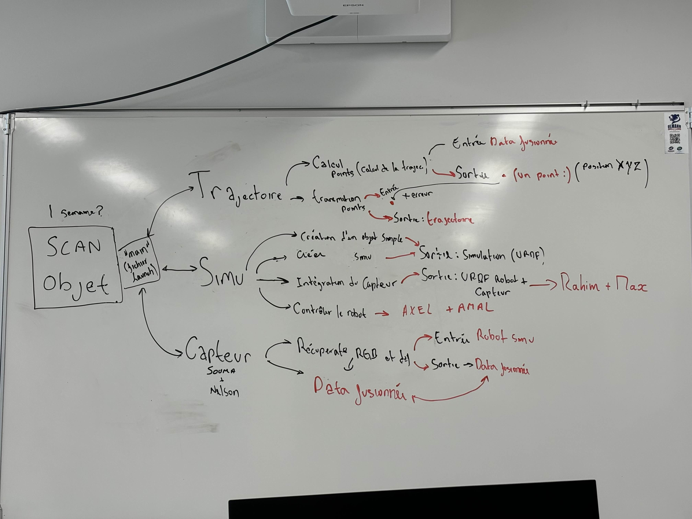
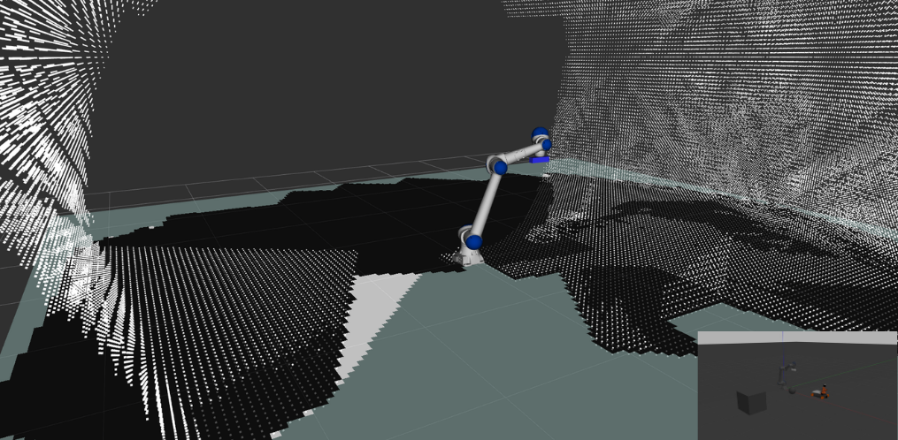
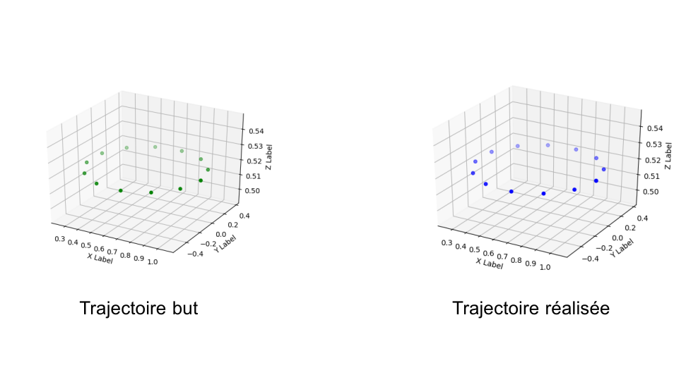

## Contexte du projet

Projet d'intégration robotique réalisé dans le cadre du cursus **SRI (Systèmes Robotiques et Interactifs)** à l'**UPSSITECH — Université Paul Sabatier (Toulouse III)**.

L'objectif : concevoir un système autonome de **numérisation 3D d'objets inconnus** à l'aide d'un bras robotique **Yaskawa HC10** équipé d'un capteur **Kinect 3D**. Le robot génère une trajectoire elliptique autour de l'objet pour le numériser intégralement, tout en évitant les obstacles en temps réel.

## Captures du projet

## Organisation et rôle

### Management
- **Équipe** : 10 étudiants ingénieurs
- **Rôle** : **Chef technique (Responsable Technique)** — supervision de l'ensemble des équipes
- **Durée** : 2 mois (septembre – octobre 2024)

### Responsabilités directes
- Réorganisation du fichier de description du robot en format **URDF/Xacro**
- Ajustement des paramètres de **MoveIt** et de commande du robot
- Mise en place de la **simulation complète** sous Gazebo

## Objectifs techniques

1. Simuler le bras Yaskawa HC10 avec un capteur Kinect intégré dans **Gazebo**
2. Acquérir et filtrer les **nuages de points 3D** issus du Kinect
3. Générer une **trajectoire elliptique adaptative** autour de l'objet cible
4. Exécuter la trajectoire via l'**API Python MoveIt** avec évitement d'obstacles

## Architecture technique

Le projet est divisé en 3 modules principaux :

### 1. Simulation
- Description robot en URDF/Xacro avec intégration du Kinect
- Kinect modélisé comme effecteur terminal avec lien d'axe optique
- Plugin caméra Gazebo configuré (taille d'image, FOV, distorsion, topics ROS)
- Solveur KDL pour la cinématique inverse

### 2. Capteur & Traitement de données

**Topics ROS clés :**

| Topic | Description |
|-------|-------------|
| `/camera/depth/image_raw` | Images de profondeur brutes |
| `/camera/color/image_raw` | Images RGB |
| `/camera/depth/points` | Nuage de points 3D (entrée principale) |
| `/camera/depth/points_black` | Nuage de points filtré (sortie) |

**Pipeline de filtrage :**
- Clustering de points par estimation des normales relativement au centroïde
- Détection et suppression du plan du sol (seuil : `s = 0.196 × |max_z − min_z|`)
- Publication du nuage filtré sur `/camera/depth/points_black`

**Intégration OctoMap :**
- `octomap_server_node` convertit les nuages filtrés en carte d'occupation 3D
- Utilisé par MoveIt pour la planification avec évitement de collisions

### 3. Génération de trajectoire

**Calcul de l'ellipse :**
- Boîte englobante du nuage de points pour calculer le centre et les demi-axes
- Ellipse mise à l'échelle par un coefficient de sécurité pour garantir une distance sans collision
- Formule : `x = C.x + a·cos(t)·scale`, `y = C.y + b·sin(t)·scale`
- `scale = 1.38`, `ε = 0.12`

**Scan multi-couches :**
- Nombre de révolutions déterminé par la hauteur de l'objet (1 couche par 10 unités de hauteur)

**Orientation caméra :**
- Quaternion calculé à chaque waypoint pour maintenir la caméra pointée vers le centre de l'objet
- Axe de rotation `δ = Z × d` et angle `θ = arccos(Z · d)`

**Commande MoveIt :**
- Bibliothèque `moveit_commander` pour envoyer des poses cartésiennes
- Chaque waypoint (x, y, z + quaternion) envoyé séquentiellement à l'API MoveIt

## Stack technologique

| Outil | Rôle |
|-------|------|
| **ROS Noetic** | Middleware robotique |
| **Gazebo** | Simulation physique |
| **MoveIt** | Planification de mouvement et exécution |
| **ROS Control** | Contrôleur bas niveau du robot |
| **OctoMap** | Génération de carte d'occupation 3D |
| **Python 3** | Scripts et API MoveIt |

> Plateforme : Ubuntu 20.04

## Résultats obtenus

Testé sur plusieurs objets dont le modèle du robot **Kuka YouBot** :
- Numérisation 3D complète visible via OctoMap dans RViz
- Erreur maximale de position : **~5×10⁻² mm**
- Erreur maximale d'orientation : **~8×10⁻² rad**

## Compétences développées

### Techniques
- **Robotique** : modélisation URDF/Xacro, cinématique inverse (KDL), MoveIt
- **Vision 3D** : traitement de nuages de points, filtrage, OctoMap
- **Simulation** : configuration Gazebo, plugins capteurs, ROS Control

### Transversales
- **Leadership technique** : supervision de 10 personnes, coordination des modules
- **Intégration système** : assemblage des briques logicielles en un système fonctionnel
- **Organisation** : découpage en work packages, suivi des livrables
