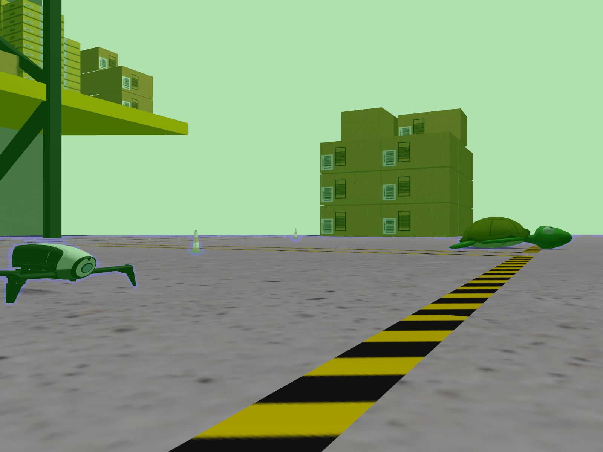
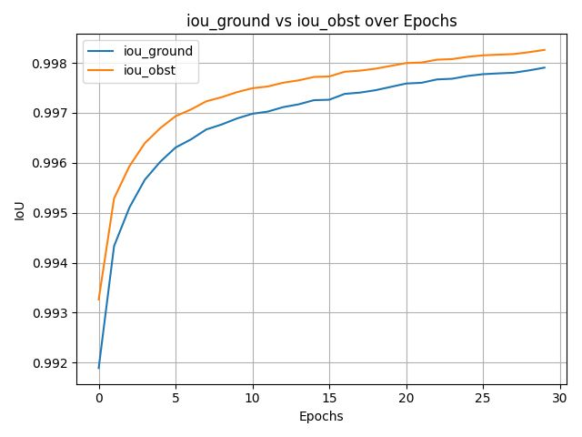

## Contexte du projet

L'objectif de ce projet était de construire une pipeline de **segmentation sémantique** capable de distinguer les zones praticables des obstacles à partir d'images RGB.

Au-delà du modèle lui-même, je voulais surtout mettre en place une base d'expérimentation propre et reproductible, afin de comparer les runs de manière rigoureuse et de mieux comprendre les limites du système.

## Captures

## Objectifs techniques

- Adapter un backbone `SegFormer` préentraîné à un problème binaire **sol / obstacle**
- Structurer un pipeline clair pour la préparation des données, l'entraînement et l'inférence
- Évaluer les performances avec des métriques réellement pertinentes pour la segmentation
- Produire des visualisations exploitables pour analyser les erreurs du modèle

## Choix techniques marquants

### Miser sur un modèle préentraîné robuste

J'ai choisi **SegFormer** via l'écosystème Hugging Face pour bénéficier d'un bon compromis entre qualité de segmentation, temps d'entraînement et rapidité d'itération.

### Structurer les expériences dès le départ

- Configuration centralisée en `.yaml`
- Splits déterministes pour comparer correctement les essais
- Sauvegarde du meilleur checkpoint selon l'IoU de la classe obstacle
- Dossiers de runs horodatés pour garder les métriques et visualisations associées

### Soigner toute la chaîne data → modèle → visualisation

Le projet ne se limite pas au training : j'ai aussi mis en place un wrapper dataset avec **Albumentations**, une inférence avec **letterbox**, et des overlays pour comparer visuellement image, masque et prédiction.

## Technologies utilisées

| Catégorie | Technologies |
|-----------|--------------|
| **Modèle** | SegFormer, Hugging Face |
| **Framework** | PyTorch |
| **Préprocessing** | Albumentations |
| **Évaluation** | IoU, Dice, Accuracy |
| **Organisation** | Configs YAML, runs versionnés |

## Défis techniques rencontrés

### Gérer le déséquilibre entre sol et obstacles

Sur ce type de problème, la classe majoritaire peut donner une impression trompeuse de bonne performance. Ce projet m'a appris à ne pas me contenter de l'accuracy globale et à suivre des métriques plus fines comme l'**IoU** et le **Dice** par classe.

### Préserver l'information spatiale

Les choix de resizing, d'augmentation et de normalisation influencent directement la qualité des masques prédits. J'ai beaucoup appris sur l'impact du preprocessing sur la segmentation, en particulier quand on cherche à préserver les contours utiles.

### Transformer des essais isolés en vraie pipeline

L'un des points les plus formateurs a été de passer d'expérimentations ponctuelles à un projet plus propre : séparation entre dataset, training, métriques, inférence et visualisation, avec une structure réutilisable.

## Ce que j'ai appris

### Vision par ordinateur et Deep Learning

- Fine-tuner un modèle de segmentation transformer sur un dataset personnalisé
- Comprendre l'effet du déséquilibre de classes sur les performances réelles
- Interpréter les erreurs du modèle à partir de visualisations qualitatives, pas seulement de scores globaux

### Rigueur expérimentale

- Rendre des expériences reproductibles avec configs, splits fixes et artefacts de run
- Choisir des métriques adaptées au problème au lieu de s'appuyer sur une seule mesure globale
- Comparer plus proprement plusieurs essais grâce à une organisation standardisée

### Software engineering appliqué au ML

- Structurer un projet ML en modules cohérents et maintenables
- Séparer configuration, chargement des données, entraînement, inférence et plotting
- Construire une base exploitable pour tester ensuite d'autres variantes de backbone ou d'autres datasets

## Résultats du projet

- Pipeline complet opérationnel pour entraînement, évaluation et visualisation
- Base expérimentale réutilisable pour comparer plusieurs variantes de segmentation
- Meilleure compréhension pratique des compromis entre qualité de masque, robustesse et reproductibilité
