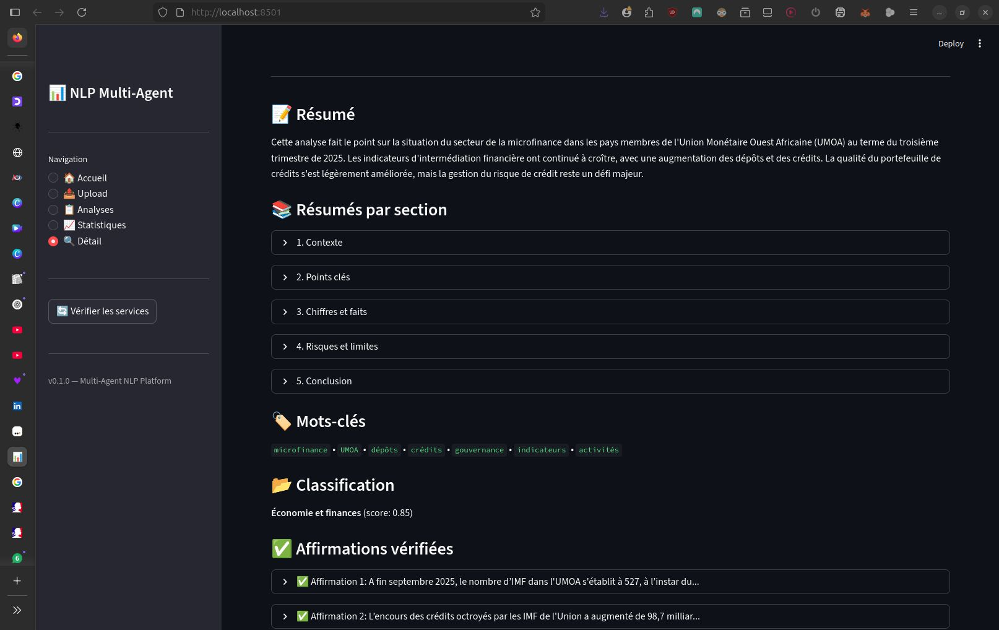
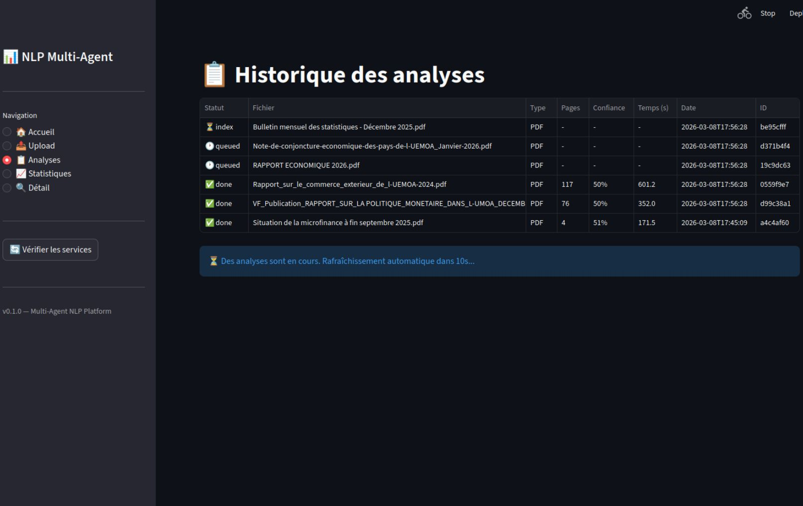

## Contexte du projet

L'objectif de ce projet était de répondre à un problème critique en NLP appliqué aux documents financiers : produire des analyses utiles **sans hallucinations**, tout en gardant une traçabilité exploitable.

J'ai donc construit une plateforme locale **100% self-hosted** avec une architecture multi-agent, où chaque étape du pipeline a une responsabilité claire et vérifiable.

## Captures





## Objectifs techniques

- Extraire proprement le contenu de documents PDF/TXT hétérogènes
- Orchestrer plusieurs agents spécialisés avec un pipeline explicite et observable
- Vérifier factuellement les affirmations avant la composition finale
- Offrir un dashboard permettant de suivre les analyses et de diagnostiquer les erreurs

## Architecture multi-agent

```text
📄 Document
    │
    ▼
┌──────────────┐
│ ParserAgent  │  → Extraction texte, structure, tables, métadonnées
└──────┬───────┘
       ▼
┌──────────────┐
│ IndexAgent   │  → Chunking, embeddings, indexation vectorielle (Qdrant)
└──────┬───────┘
       ▼
┌──────────────┐
│ AnalystAgent │  → Résumé, mots-clés, classification, claims
└──────┬───────┘
       ▼
┌───────────────┐
│ VerifierAgent │  → RAG retrieval + reranking + NLI (anti-hallucination)
└──────┬────────┘
       ▼
┌──────────────┐
│ EditorAgent  │  → Composition finale vérifiée + score de confiance
└──────────────┘
       │
       ▼
   📊 Résultat JSON + Dashboard
```

## Technologies utilisées

| Composant | Technologie |
|-----------|-------------|
| API Backend | FastAPI |
| Orchestration agents | LangGraph |
| LLM local | Ollama + Qwen2.5-7B-Instruct |
| Embeddings | BAAI/bge-m3 |
| Reranker | BAAI/bge-reranker-base |
| Vérification factuelle | mDeBERTa-v3-base-mnli-xnli |
| Parsing documents | PyMuPDF |
| Base relationnelle | PostgreSQL |
| Base vectorielle | Qdrant |
| Queue tâches | Redis + Celery |
| Dashboard | Streamlit + Plotly |
|
## Décisions techniques marquantes

### Fiabilité avant génération

- Vérification systématique des claims par **RAG + reranking + NLI**
- Rejet des affirmations non supportées avant édition finale
- Sorties enrichies avec preuves (page, chunk, citation)

### Orchestration robuste

- Décomposition en 5 agents spécialisés avec responsabilités non ambiguës
- Gestion d'états explicite (`queued` → `done` / `error`) pour diagnostiquer rapidement
- Design orienté reprise sur incident (timeouts, retry par étape, `failed_step`)

### Déploiement local maîtrisé

- Stack locale cohérente (Ollama + embeddings + reranker + NLI)
- Aucun appel API externe, meilleure maîtrise des coûts et de la confidentialité

## Défis techniques rencontrés

### Réduire les hallucinations sans casser la fluidité

Le principal défi a été de trouver l'équilibre entre qualité du texte final et contrôle factuel strict. J'ai appris à séparer clairement génération, vérification et édition pour éviter les sorties convaincantes mais non fondées.

### Gérer l'hétérogénéité documentaire

Les rapports PDF/TXT présentent des structures très variables (sections, tableaux, bruit). Le travail sur le parsing et le chunking a été déterminant pour améliorer la pertinence du retrieval.

### Fiabiliser un pipeline distribué

Avec plusieurs briques (API, queue, DB relationnelle, store vectoriel, modèles), la robustesse repose sur l'observabilité : statuts précis, erreurs contextualisées, et reprise maîtrisée par étape.

## Ce que j'ai appris

### NLP et IA

- Concevoir une chaîne **RAG + reranking + NLI** orientée fiabilité
- Formaliser des claims vérifiables plutôt que des résumés opaques
- Évaluer la qualité d'un système au-delà du simple rendu textuel
- Penser la confiance utilisateur comme une propriété technique à construire, pas comme un effet du modèle

### Architecture logicielle

- Orchestrer un workflow multi-agent avec **LangGraph**
- Structurer une application modulaire (agents, services, API, worker)
- Penser la persistance et la traçabilité dès la conception
- Concevoir un pipeline observable, reprenable et plus facile à diagnostiquer

### Engineering produit

- Construire un dashboard utile pour l'analyse et le debug métier
- Transformer des besoins de confiance en exigences techniques mesurables
- Prioriser la maintenabilité et la résilience dans un projet IA

## Résultats et impact

- Pipeline de traitement complet opérationnel, de l'upload au rapport vérifié
- Amélioration de la confiance utilisateur grâce à la justification des claims
- Base technique solide pour industrialiser l'analyse documentaire locale

Temps de traitement observé : **1 à 4 minutes par document** selon la taille, sur la configuration testée.
